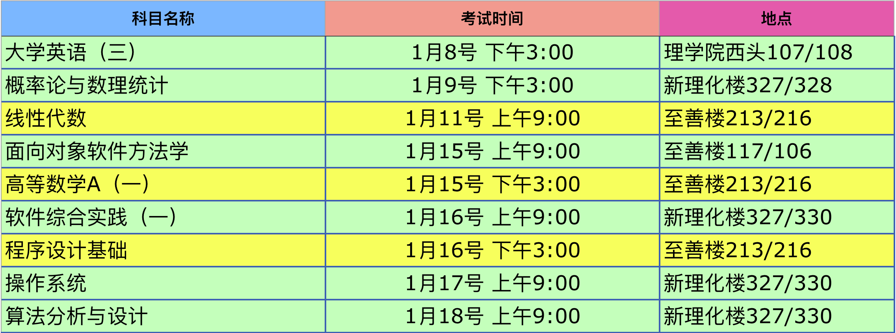

考试安排

<table id="grid5650261791" class="gridtable">
<thead class="gridhead">

<tr>
<th  width="10%" class="gridhead-sortable" id="courseTake.lesson.no">任务序号</th>
<th  width="15%" class="gridhead-sortable" id="courseTake.lesson.course.name">课程名称</th>
<th  width="12%" class="gridhead-sortable" id="courseTake.lesson.courseType.name">课程类别</th>
<th  width="10%" class="gridhead-sortable" id="courseTake.lesson.course.credits">学分</th>
<th  width="15%" >考试时间</th>
<th  width="12%" >考试地点</th>
</tr>

</thead>

<tbody id="grid5650261791_data"><tr><td>12160054.03</td><td>线性代数</td><td>专业必修课</td><td>4</td><td>                第19周 星期五 09:00-11:00
                
</td><td>                        
                
</td></tr><tr><td>12160137.02</td><td>概率论与数理统计</td><td>专业必修课</td><td>3</td><td>                第19周 星期三 15:00-17:00
                
</td><td>                        新理化楼328 新理化楼327
                
</td></tr><tr><td>12160138.02</td><td>面向对象软件方法学</td><td>专业必修课</td><td>3.5</td><td>                第20周 星期二 09:00-11:00
                
</td><td>                        至善楼106教室 至善楼117教室
                
</td></tr><tr><td>12160141.01</td><td>操作系统</td><td>专业必修课</td><td>3</td><td>未安排
</td><td>未安排
</td></tr><tr><td>12160142.02</td><td>算法分析与设计</td><td>专业必修课</td><td>3</td><td>未安排
</td><td>未安排
</td></tr><tr><td>12160148.01</td><td>软件综合实践（一）</td><td>专业必修课</td><td>2</td><td>未安排
</td><td>未安排
</td></tr><tr><td>12160174.02</td><td>程序设计基础</td><td>专业必修课</td><td>4</td><td>                第20周 星期三 15:00-17:00
                
</td><td>                        至善楼216教室 至善楼213教室
                
</td></tr><tr><td>12160175.02</td><td>高等数学A（一）</td><td>专业必修课</td><td>5</td><td>                第20周 星期二 15:00-17:00
                
</td><td>                        至善楼216教室 至善楼213教室
                
</td></tr><tr><td>28160003.19</td><td>大学英语（三）</td><td>公共必修课</td><td>2</td><td>                第19周 星期二 15:00-17:00
                
</td><td>                        理学院大楼西头107 理学院大楼西头108
                
</td></tr></tbody>
</table>
