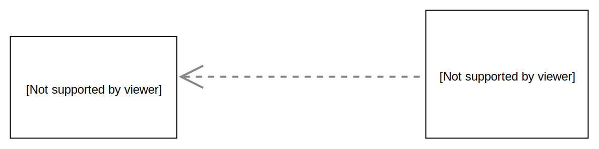
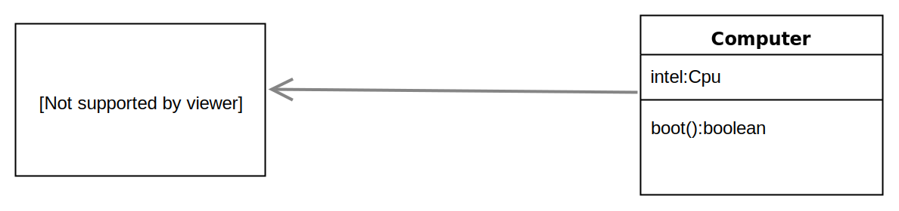
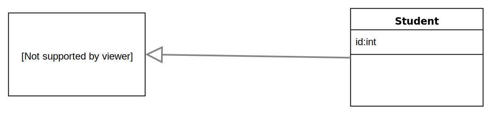

Java考试的内容实在太多了，今天先把各种了之间的关系复习一下。

> 在所有的连线中，没有特殊图形的一端均表示线的结束，起始端是没有任何图形的。

# 依赖关系

- UML中表示方法:用一条带箭头的虚线连接两个类的UML图，其中结束端即箭头指向被依赖的类
- 定义: 如果一个类作为另一个类某个方法的返回值类型或者参数类型，那么这两个类就构成了依赖关系。

例如: 台式电脑需要连接电源🔌供电(指电能而非机箱内的电源)才能启动，电源供电并不是台式电脑的属性(成员)，而是作为电脑💻启动这个方法不可或缺的条件。电脑和电能就构成了依赖关系。

Code of Computer:
```java
class Computer{
	boolean switch=false;

	boolean Boot(EPower e){
		return (e.state==true)&&switch?true:false;	
	}
}
```
Code of EPower:
```java
class EPower{
	boolean state;	
}
```




# 关联关系
记忆:依赖关系和关联关系都是结束端的箭头都是相同的，而关联是实线，` 联 ` 的同音` 连 `为实线，并且实线较虚线有关系更强的意思。

- 在UML类图中: 用带箭头的实线连接两个相互关联的类，其中箭头表示的结束段指向被关联的类
- 定义: 如果一个类声明的对象作为另一个类的数据成员(属性、成员变量)，那么这两个类之间就形成了关联关系。

例如: CPU(中央处理器)作为计算机不可缺少的一部分，CPU就是计算机的属性。

Code of Cpu:

```java
class Cpu{
   String structure;
}
```
Code of Computer:

```Computer
class Computer{
	Cpu intel =  new Cpu();
	boolean boot(){
		return true;
	}
}
```


# 泛化(继承)关系

- UML类图中，用一条实线加空心的三角形来表示继承关系，一个类继承另一个类，被继承的类叫父类或者基类，另一个叫子类或者派生类。用空心三角形指向父类

例如: Stuent是人，有` 人 `的一切属性和行为，Student继承自父类Human

Code of Student:

```java
class Student extends Human{
	int id;
}
```

Code of Human{

```java
class Human{
	String name
	int age;
	void Speak(){
		System.out.println("Hello");
	}
}
}
```



# 实现关系

- 在UML图中用虚线和空心三角形连接接口和实现接口的类。虚线的终点端是它实现的接口。
例如: 笔记本是计算机的一种实现，只有有中央处理器，有输入输出设备就是一台计算机。

Code of Computer:

```java
interface Computer{
	String Cpu
	String Input
	String Output

	void Run();
}
```

Code of Laptop:

```java
class Laptop implements Computer{
	public void Run{}
}
```


